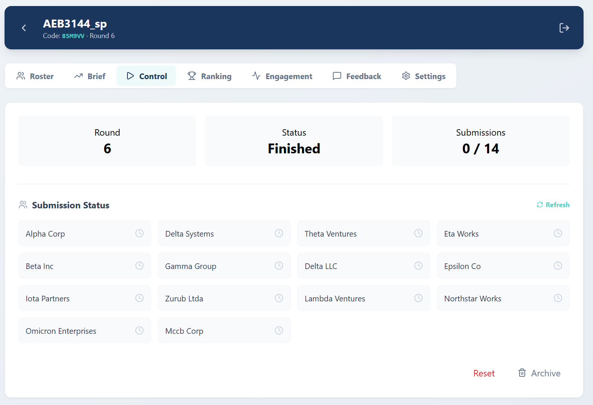
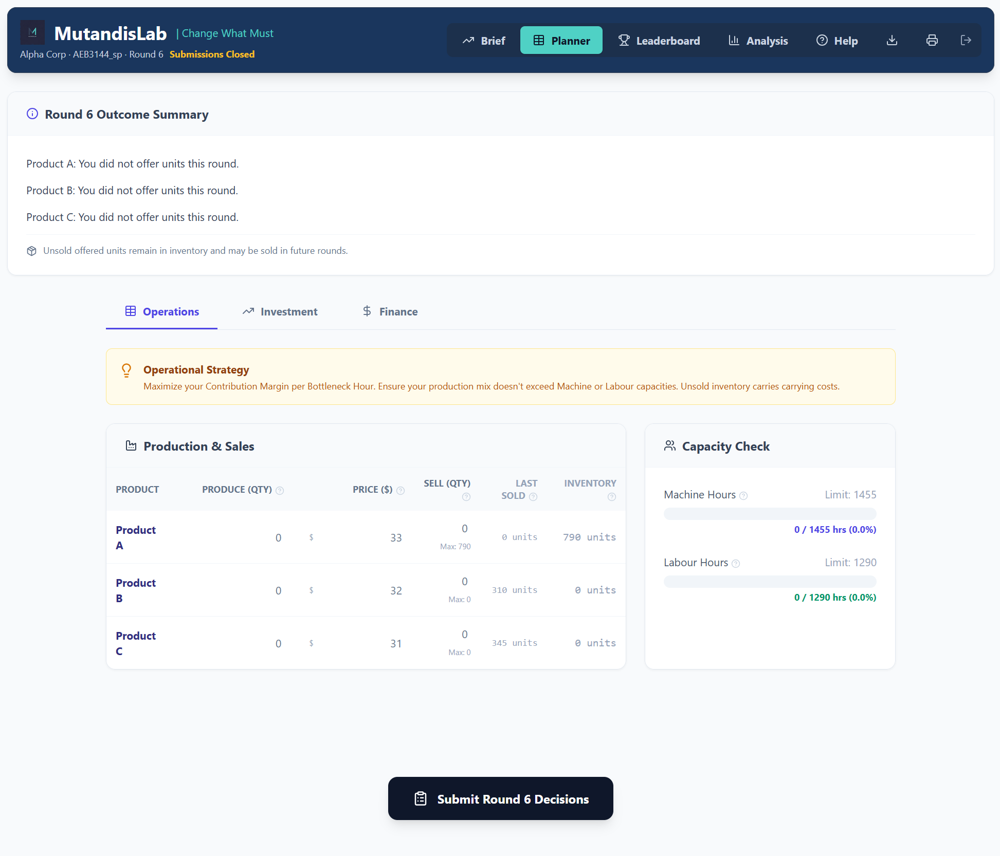
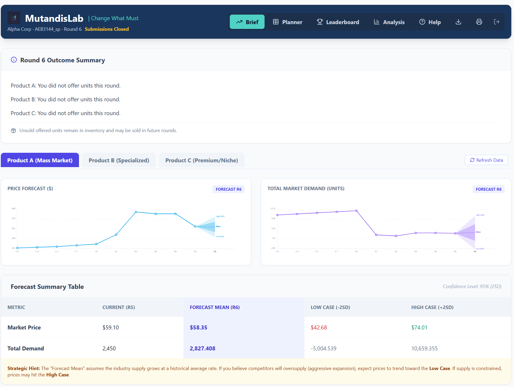
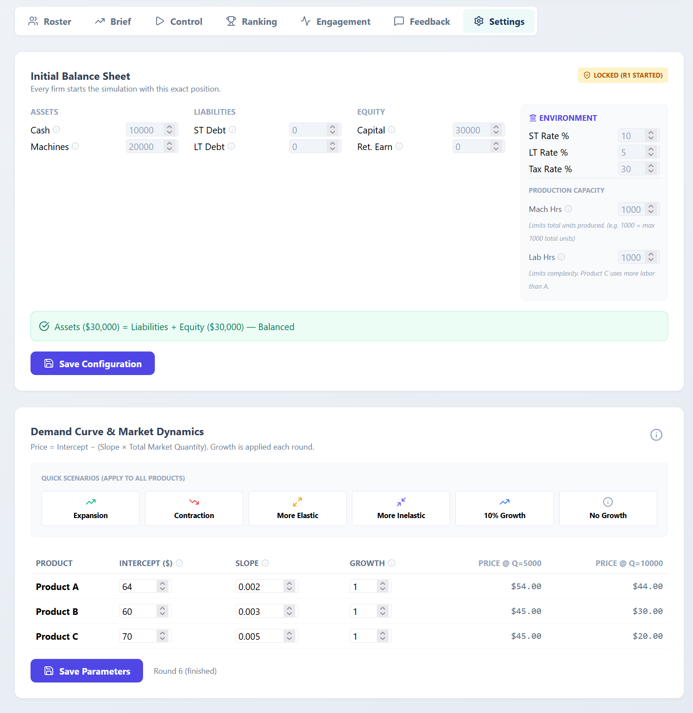
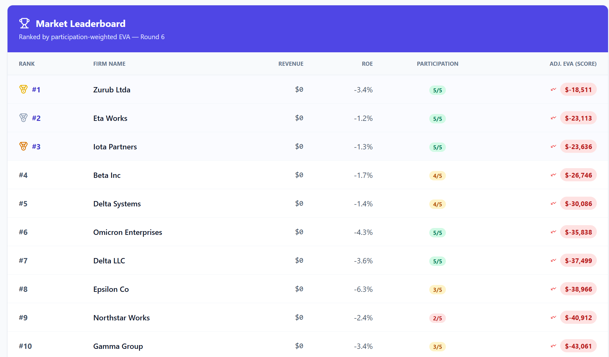

:::{.callout-tip}
## TL;DR
[MutandisLab](https://mutandislab.com) is a browser-based classroom simulation in which students run competing firms over N rounds. Each round they decide what to produce, how to price it, how to finance it, and where to invest. A market-clearing mechanism settles prices, full financial statements are produced automatically, and firms are ranked by *Economic Value Added* (EVA). It is free to use at <https://mutandislab.com>.
:::

## Why I built it

Problem sets get the accounting identities right but miss the part of business that matters most, deciding under uncertainty while everyone else is also deciding. I wanted a teaching tool where students would feel the tension between price and volume, between borrowing to invest and protecting cash, and between expanding capacity and watching the whole class flood the market at the same time. Most existing classroom simulations are either expensive textbook tie-ins or single-player toy models, so I built one for the corporate-finance and operations content I teach.

The result is a real multiplayer environment. For example, a class of 14 firms runs simultaneously, and each round their collective decisions move the market.

## What students do each round

Decisions are split into three tabs.

### Operations

Production quantity, asking price, and sales intent for each of three products (A, B, C). Real-time capacity bars show machine-hour and labour-hour utilization. Unsold inventory carries forward (FIFO), tying up cash.

### Finance

New short-term and long-term debt, voluntary principal repayments, and dividends. A live projected income statement and balance sheet update as students enter decisions, with a cash-flow warning if the firm is heading into the red.

### Investment

Buy machine capacity (available next round) or train workers (recognized as expense this round).

## How the market clears

Each product has a demand curve. Every firm's price-quantity offer is stacked into a merit order, and the system finds the clearing price where supply meets demand:

- If your asking price is at or below the clearing price, you sell every unit you offered, at the clearing price.
- If your price is above it, you sell nothing. Units go to inventory.

That binary outcome makes pricing feel real. Too high and revenue is zero, too low and you leave money on the table. To plan, students consult a Market Brief with AR(1) forecasts of price and total demand, with Low, Mean, and High cases on a 25th–75th-percentile band.

The forecasts are honest about uncertainty. They assume the industry continues at its historical average growth, and they warn the student that if competitors over-expand, the actual clearing price will fall toward the Low case.

## What the instructor sees

Three things matter for running a class smoothly. The instructor configures the starting position, controls the round lifecycle, and reviews loan requests.

### Settings

The instructor sets every firm's initial balance sheet, the environment rates (short-term, long-term, tax), production capacity, and the demand curve for each product. Six quick scenarios (Expansion, Contraction, More Elastic, More Inelastic, 10% Growth, No Growth) make it easy to swap market regimes between sections.

### Control

The instructor opens each round, monitors submission status by firm, reviews loan requests (with a *Smart Suggest* option that assigns rates by credit rating), clears the market, and then debriefs results with the class.

## Scoring

The primary metric is *Economic Value Added*:

$$
\text{EVA} = \text{Net Income} - (\text{Equity} \times 12\%)
$$

A positive EVA means the firm beat the 12% cost of equity. The leaderboard ranks firms by participation-weighted cumulative EVA across all six rounds, so a firm that submitted in every round is not penalized by no-shows.

Forced liquidation (inventory at 70%, fixed assets at 50%) kicks in if cash goes negative, a hard but honest lesson about leverage. The negative-EVA cluster at the top of this leaderboard is itself a teachable moment. In a market where most firms expanded capacity simultaneously, supply flooded the market and clearing prices crashed. The "winner" is the firm that lost the least.

## Try it with your class

Free, browser-based, no install. Live at <https://mutandislab.com>. If you teach a corporate-finance, operations, or strategy course and would like to pilot it with your students, send me an email at [aceballos@ufl.edu](mailto:aceballos@ufl.edu). I'm collecting feedback from a few sections this term and happy to walk you through setup.
